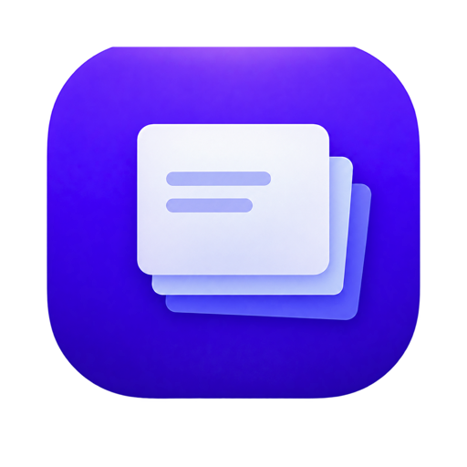
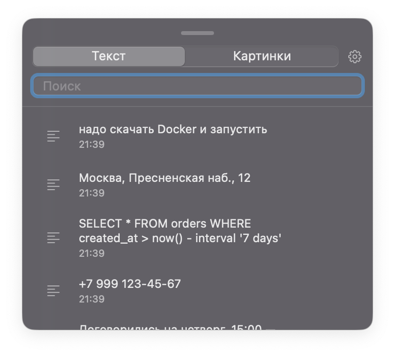
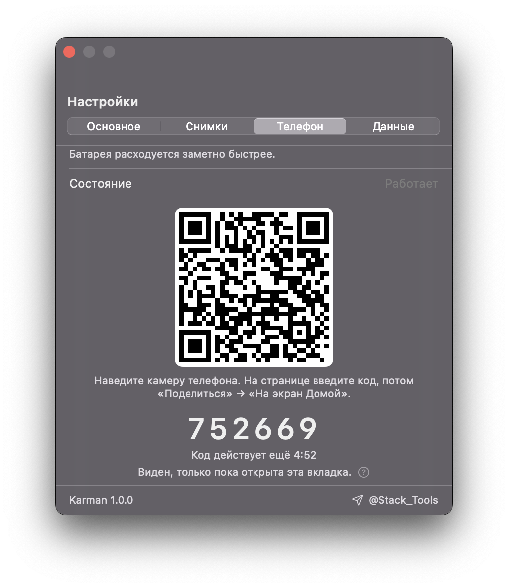
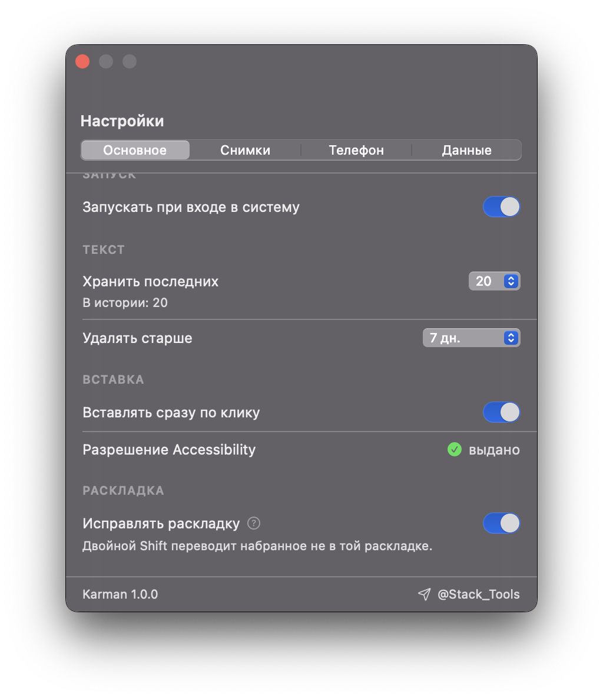

про

# Karman

**Буфер обмена, полка скриншотов и исправление раскладки для Mac.**
Живёт в строке меню, в Dock не появляется.

[**Скачать Karman 1.1**](../../releases/latest) · macOS 13+ · Apple Silicon и Intel · бесплатно

---

## Что умеет

**История буфера.** `⌥⌘V` открывает панель с последним скопированным. Щёлкнул — положил обратно в буфер, `⌘V` вставил. Можно включить вставку сразу по щелчку.

**Полка скриншотов.** Снимки экрана попадают в ту же панель. Рабочий стол перестаёт зарастать: включите «Хранить только в Karman», и файл уходит с него сразу.

**Исправление раскладки.** Набрали `ghbdtn` вместо «привет» — двойной `Shift` перепишет как надо. Английские слова внутри фразы Karman оставляет: `yflj crfxfnm Docker` превращается в «надо скачать Docker», а не в кашу.

**История на телефоне.** Наводите камеру на QR-код, и телефон открывает список скопированного в браузере. Ставить на телефон нечего, аккаунта не нужно, данные идут напрямую по вашему Wi-Fi. Работает и на iPhone, и на Android.

## Мелочи, которые заметны на второй день

- `⌘`-щелчок выбирает несколько записей, и они уезжают в чат одним перетаскиванием
- Пробел или правый щелчок открывают крупный просмотр, как в Finder
- Файл, брошенный на значок в строке меню, попадает в историю
- Пароли из 1Password и Bitwarden в историю не пишутся
- Панель тащится за верхний край и запоминает место
- Интерфейс на русском и английском, язык берётся из системы

## Установка

1. Скачайте `Karman.dmg` со [страницы релизов](../../releases/latest)
2. Перетащите **Karman** в папку **Программы**

**Первый запуск macOS заблокирует.** Приложение не заверено у Apple: подпись стоит 99 долларов в год, и на бесплатной программе я её не держу.

- **macOS 14 и старше:** правый щелчок по Karman → **Открыть** → в окне ещё раз **Открыть**
- **macOS 15 Sequoia и новее:** двойной щелчок, закрыть предупреждение, дальше **Системные настройки → Конфиденциальность и безопасность → Открыть всё равно**

Это делается один раз. Подробная инструкция со скриншотами лежит в [УСТАНОВКА.md](УСТАНОВКА.md).

## Приватность

История лежит на вашем компьютере, в `~/Library/Application Support/Karman`, правами `0600`. Наружу ничего не уходит: у Karman нет ни сервера, ни аналитики, ни аккаунта. Раздача на телефон идёт по вашей локальной сети напрямую и выключена, пока вы её не включите.

## Разрешения

| Что | Зачем | Обязательно |
|---|---|---|
| Accessibility | вставка по щелчку и исправление раскладки | нет, без него `⌘V` вручную |
| Входящие подключения | раздача истории на телефон | нет, только при включённой раздаче |

Karman не читает набираемый текст. Для исправления раскладки он берёт то, что выделено или стоит перед курсором, и только в момент нажатия.

## Windows

Версия для Windows 11 существует и работает: история, панель, вставка,
раздача на телефон, привязка iPhone и Android. Сейчас она **в доработке** —
допиливаю закрепление записей, крупный просмотр и кнопку «Поделиться».
Выложу отдельным релизом, следите в [@Stack_Tools](https://t.me/Stack_Tools).

## Обратная связь

Ошибки и пожелания — в [Issues](../../issues) или в телеграм [@Stack_Tools](https://t.me/Stack_Tools).

---

<b>In English</b>

Karman is a clipboard manager, screenshot shelf and keyboard-layout fixer for macOS. It lives in the menu bar and stays out of the Dock.

- `⌥⌘V` opens the history panel; click an item to put it back on the clipboard
- Screenshots land in the same panel and can be cleared off your desktop automatically
- Double `Shift` converts text typed in the wrong keyboard layout, leaving real English words alone
- Point your phone's camera at a QR code to browse the history in its browser, over your own Wi-Fi, with nothing to install

Requires macOS 13 or newer. Free, no account, no telemetry. The app is not notarised, so the first launch needs a right-click → Open (macOS 14 and earlier) or an **Open Anyway** in Privacy & Security (macOS 15 and later).

